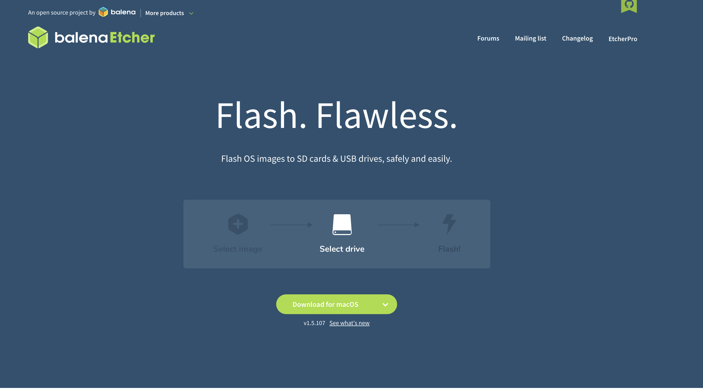
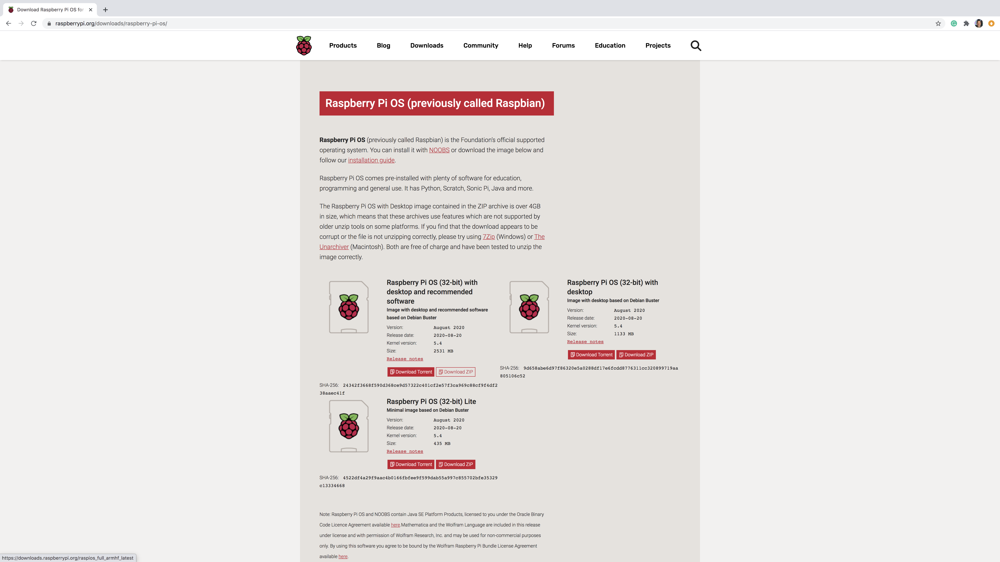
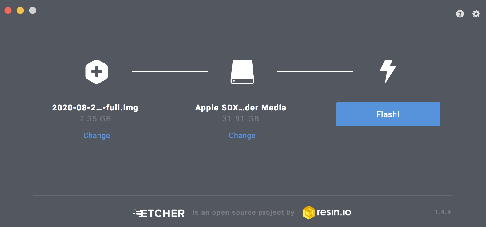

## Step 1: Get the equipment

## Step 2: Get Etcher

* Go to: https://www.balena.io/etcher/
* Download Etcher for desired operating system.

</a>

## Step 3: Download the raw image

* Go to: https://www.raspberrypi.org/downloads/raspberry-pi-os/
* (For Mac) download the .zip file
* I chose "Raspberry Pi OS (32-bit) with desktop and recommended software"

</a>

## Step 4: Use Etcher to flash your microSD card

* Unzip downloaded file to an .img
* Insert card into computer
* Open Etcher it should see insert microSD
* Select image and flash card
* Flashing can take a few to many minutes, so be patient
* After flashing Etcher will validate the flash, this takes time to, so continue to be patient.

</a>

## Step 5: Boot ya PI

* Get card from your Mac/PC
* Physically insert microSD into PI as designed
* Plug in physical keyboard and mouse
* Plug in monitor
* Plug in the Pie

## Step 6: Walk through One Time Prompts

## Step 7: Enable VNC Server

Make sure to set a password for MAC "Go To Server"